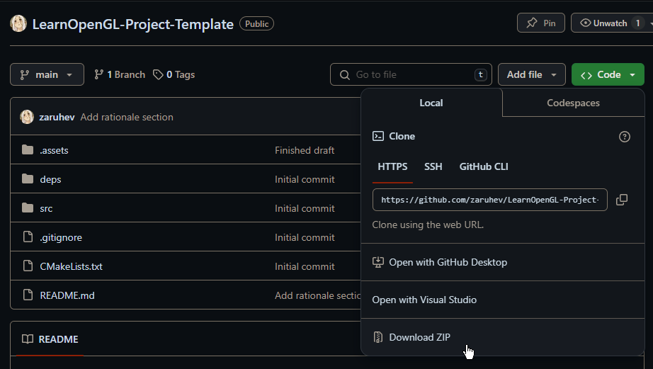
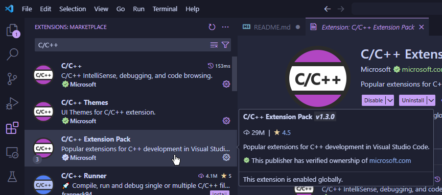
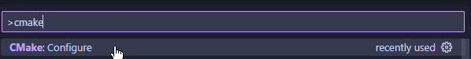
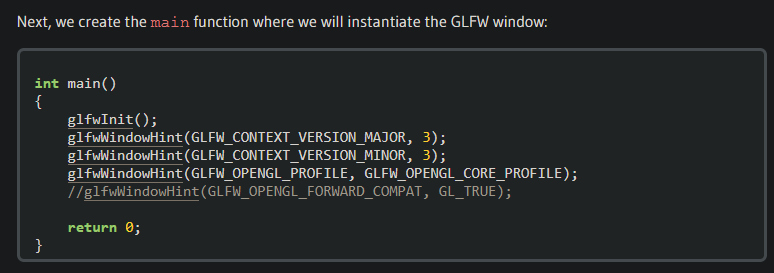
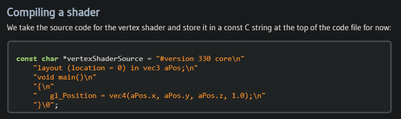

# (Probably) Your First C++ Project

Hello there :). You're probably here because you want to create your first
useful project in C++, maybe to test your knowledge of the language, or of
your ability to follow tutorials on the internet and apply your knowledge
through them. Nonetheless, this document will (somewhat) guide you through
creating your first OpenGL program in C++ :).

The "Hello world" of computer graphics programming is arguably drawing a
simple triangle, so we will aim to do precisely that in this lab! However,
this document will not contain the steps/example code and theory behind
OpenGL. Instead, that will be delegated to 
[LearnOpenGL](https://learnopengl.com/).

The main purpose of this repository (or *repo*) is to scaffold the creation
of all the building information for such a project. However, because specific
versions of the dependencies are used in this lab, some of the things done
in this exercise will differ from LearnOpenGL. They will be documented here.

# Rationale
When I first got into C++ and OpenGL programming, I struggled a lot with
understanding the various build systems often used in the development space.
I spent a long time trying to grasp how any of the build tools work,
especially because I'm not the type of person to be comfortable with using
things I don't have the slightest clue about (this is why I specifically
avoided Visual Studio for the longest time, and find little use for it
outside of it's robust debugging system, anyway). 

I found myself spending
more time trying to work with tools I hardly understood rather than actually
learning things, and it doesn't help that CMake was very difficult to learn
from guides alone, without already having experience using it, or a tool like
it.

I want this project to serve as a stepping stone for people in the same
position that I was when I first started learning C++ and computer graphics
on my own, especially if said people want to truly understand the toolchains
they will rely on in the long-term.

# Requirements
* Git (optional)
* GCC (I recommend downloading the w64devkit from GitHub)
* CMake
* Visual Studio Code (recommended) (NOT Visual Studio, we're not using that.)

# Getting Started
If you're reading this on GitHub, clone this repo. If you're reading this
in an editor, good :).

## Download Project Template
If you know how to use GitHub to manage git repositories, you won't need this
section :)

### Using Git
If you'd like to manage this project template using Git,
make sure you have the Git toolchain installed on your machine.
The various download binaries can be downloaded from https://git-scm.com/downloads.

When Git is installed, open a new command terminal. Navigate to a folder
of your choice, and run the following:
```cmd
C:\...\> git clone https://github.com/zaruhev/LearnOpenGL-Project-Template.git
```
> If my username is no longer zaruhev, then replace zaruhev with my current
> username :p

You're done! Now you can proceed to the next section.

If you want to wipe and reset the project template:
```cmd
C:\...\opengl-triangle> git fetch
C:\...\opengl-triangle> git reset --hard origin/main
```

### NOT Using Git


## Set up GCC
**NOTE: If you already have GCC, feel free to skip this section :)**


Before we can build any software, we need the software that actually builds
the software (don't worry about how that software was build just yet.) In
this lab, you will use the [w64devkit](https://github.com/skeeto/w64devkit)
to install and use the GNU Compiler Collection (GCC).

### Steps
**1\.** Download the latest release of w64devkit https://github.com/skeeto/w64devkit/releases. Unless you know what you are doing, download the
top-most `.zip` file. For example, if using version `1.23.0`, the
zip file would look like `w64devkit-1.23.0.zip`.

**2\.** Extract the zip file into any directory you feel like. Personally, I
install w64devkit under `C:\Users\XXXXX\.devtools\w64devkit`, but that is
entirely up to you.

**3\.** Add `<wherever you put the folder>\w64devkit\bin` to your system PATH. The
way this is done varies between systems, and there are lots of ways to
accomplish this. Apply your own researching skills to solve this problem.

**4\.** Verify that the GCC suite is added to your path by opening a new command
prompt and entering `g++`. If your output looks something like:
```cmd
g++: fatal error: no input files
compilation terminated
```
then you did everything correctly :)!

**5\.** Just for good measure, if you have Visual Studio Code open, close and
re-open it. The system PATH is often virtualized in the editor and has to be
refreshed by restarting VSCode.

## CMake
As you may already know:
In order to build most software, a bunch of compiler and builder commands
must be invoked to convert human-readable code into machine instructions.
This is typically bootstraped with *build tools* or *build scripts* that
streamline the process of building applications. In this exercise (and
likely many projects down the line), you will use CMake.

We utilize CMake in this lab to automate the build process of your OpenGL
program. Understanding CMake is not necessary here, as all the necessary
code is provided (and for the most part tested). In this lab, the steps for
setting up an environment using CMake and actually invoking CMake are
provided.

> If you *really* want to know how to use CMake, feel free to read 
> `CMakeLists.txt`. It's a simple script, however understanding it is not
> in the scope of this project. Save yourself the headache if you want to
> see a triangle in the next business hour. **NOTE that this is not a
> comprehensive guide on CMake, and thus we will only gloss over its
> usage.**

Before you are thrown into an IDE or a feature-rich code editor like
Visual Studio Code, you will learn how to call CMake from the *command line*.

### Using CMake from the command line
Usually, we may invoke CMake simply by entering:
```cmd
C:\...\opengl-triangle> cmake .
```

However, relying entirely on cmake's build scaffolding may result in
unwanted behavior depending on your operating system, and on what 
programs are installed.

> If you have installed Visual Studio for Windows in the past, call cmake
> as the command is written in the snippet above. You might observe that
> it calls upon the Visual Studio build tools to configure your project.
> Now, delete the `build` and `CMakeFiles` directories (as well as any 
> other files generated by CMake) to avoid any issues building later.

Because it is meant to abstract from the internal toolchain used to build
C++ programs, CMake typically assumes what compiler suite you want to use
to build software. On a Windows system, it often defaults to the MSVC
toolchain for Visual C++. However, because we are using GCC, we need to
specify such when calling CMake.

### Steps
**1\.**
To accomplish this, we must specify what *generator* CMake will use to
scaffold our project build. To do this, we may call `cmake` and pass the
`-G` argument as such:
```cmd
C:\...\opengl-triangle> cmake . -B build -G "Unix Makefiles"
-- The C compiler identification is GNU XX.X.X
...
-- Build files have been written to: C:/.../opengl-triangle/build
```
> We specify the build directory (with `-B`) as `build/` so we dont
> plague the source directory with build scaffolding. You'll see why
> if you preview the contents of `build/` :).

When you add new files and/or change the `CMakeLists.txt` file, this
command must be run again in order to configure all of the dependencies
and local source/header files. A development environment will typically
handle this automatically (you will see how to manage this in vscode
shortly), but for now we will call these commands manually.

**2\.**
Now that our project is configured by CMake, we can build this project
by calling `cmake` on the `build/` directory:
```cmd
C:\...\opengl-triangle> cmake --build build -j 12
```
> We specify `-j 12` in order to tell GNU Make to build with up to 12
> threads. This can be set to however many cores your processor supports.
> This is done to speed up compilation times. The usage of the `-j` argument
> is specific to GCC, so you should never write this in a CMake toolchain
> unless it is specifically *for* a GCC project. Just saving time :)

**3\.**
If CMake was successful, you may now call the built program by entering the
following in the terminal:
```cmd
C:\...\opengl-triangle> .\build\opengl_triangle.exe
Hello, world!
```

Now you can start programming! Dont forget to configure CMake when a new
file is added to your project. It's safe to code entirely outside of a
code editor; however, it is often easier to use one :)

## Using CMake/GNU with Visual Studio Code
The **C/C++ Extension Pack** for Visual Studio Code includes convenient support for CMake and various C and C++ compilers. You can install the
extensions it features by searching for it in the extensions tab:




When all of the extensions are installed, restart Visual Studio Code (if not already prompted to do so). Then, whenever you open a CMake project, open
the command palette by typing `CTRL+Shift+P`, and entering "cmake" and selecting `CMake: Configure`:




> If/when prompted, select the GCC toolchain in the list of tools to use
> in this CMake project. In the future, select whatever toolchain you know
> you should use for a project.

At the bottom-left corner of your Visual Studio Code UI should be a few
buttons, including a Build command, a little debug icon (it looks like a
little beetle), and the build-and-run button (the play button):


Whenever you want to build and run your program, press the build-and-run
icon. It will automatically call CMake to build your project, then your
target program will be called.

The `Build` widget is used to build your project without executing it, which
is very useful when your software relies on post-build configurations but you
don't want to execute anything, or when you're building a library instead of
an application :).

In the next section, we will make a couple remarks regarding LearnOpenGL that
are specific to this project template.

# LearnOpenGL
As mentioned, you will learn how to render a simple triangle using OpenGL from
https://learnopengl.com/. Read the `Introduction` section, and the 
`Getting Started` section up to `Hello Triangle`. You're on your own after
this section, so do your best :).

Lastly, you may skip `Creating a Window`, as it is concerned with configuring
a project in another development environment. Feel free to read it if you want
to understand the significance of the libraries used in this project!

Relevant readings:
* https://learnopengl.com/Getting-started/OpenGL (optional)
* https://learnopengl.com/Getting-started/Hello-Window
* https://learnopengl.com/Getting-started/Hello-Triangle

## Remarks
In `Hello Window`, the following snippet is provided:




As described in the article, the context version hints specify what versiobn
of OpenGL should be loaded by GLFW. For this project, specify OpenGL version
`4.6`:

```cpp
int main() {
    glfwInit();
    glfwWindowHint(GLFW_CONTEXT_VERSION_MAJOR, 4);
    glfwWindowHint(GLFW_CONTEXT_VERSION_MINOR, 6);
    // ...
}
```

Lastly, in `Hello Triangle`, the provided shader programs begin with a
`#version 330 core` directive. Edit both of these to specify 
`#version 460 core` instead.




# Next Steps
Now you can begin learning OpenGL in (probably) your first C++ project! Feel
free to open an issue if any of these steps are confusing or don't work on
some systems. Contributions are welcome.

# Contributions
Feel free to open an issue if anything is wrong with this walkthrough.
Edits are welcome. I admit that the CMakeLists and dependency management
is not as robust as it can be, but I did not want to spend long on the project
template as I made this project on a bit of a whim.